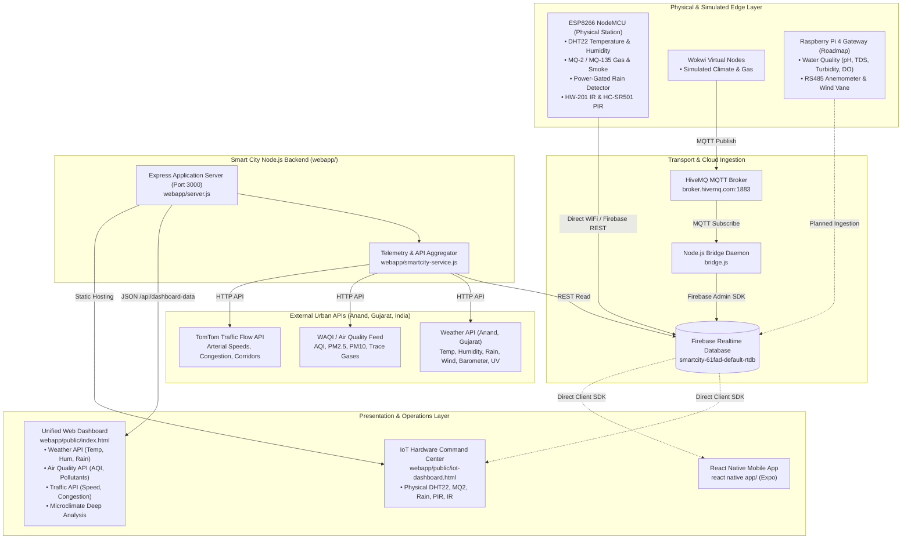

# Smart City IoT & Urban Telemetry Platform - Context & Technical Reference

This document serves as the central engineering specification and architecture reference for the **Smart City IoT & Urban Telemetry Platform** focused on **Anand, Gujarat, India**. It details the hardware layer, firmware, backend services, external APIs, web application, mobile app, and execution roadmap for future development.

---

## 1. Executive Summary

The **Smart City Platform** is a unified cyber-physical telemetry system that continuously monitors urban microclimate, environmental safety, air purity, and traffic mobility in real time.

### Core Pillars:
1. **Physical Sensor Telemetry**: Real-time readings from hardware microcontrollers (ESP8266, ESP32, Raspberry Pi) tracking temperature, humidity, hazardous gases, infrared obstacles, motion, and precipitation.
2. **Tri-Domain Urban Monitoring**:
   * **Weather & Microclimate**: Real-time Anand atmospheric telemetry (Temperature, Humidity, Rain volume & probability, Barometric pressure, Wind heading, UV, Visibility) driven exclusively by live Weather API, with physical sensor microclimate preserved in the dedicated IoT Command Center.
   * **Air Quality Index**: EPA/NAAQS-compliant particulate ($\text{PM}_{2.5}, \text{PM}_{10}$) and trace gas monitoring ($\text{NO}_2, \text{O}_3, \text{CO}, \text{SO}_2$).
   * **Urban Traffic & Mobility**: TomTom Traffic Flow integration tracking arterial velocity, congestion indices, and key transit corridors.
3. **Multi-Platform Access**:
   * **City Operations Web Portal**: Unified analytics dashboard and dedicated hardware IoT command center.
   * **Citizen & Operator Mobile App**: React Native / Expo application with alert thresholds and offline resilience.

---

## 2. System Architecture



---

## 3. Directory & File Inventory

```
D:\smartcity/
├── .gitignore                                           # Security exclusions (node_modules, service account keys)
├── API firebase.txt                                     # Firebase credentials (API Key & RTDB Database URL)
├── API wheather and air quality.txt                     # External API configurations (Weather, WAQI, TomTom)
├── EXPO_MOBILE_PLAN.md                                  # Mobile application architecture and implementation plan
├── bridge.js                                            # MQTT-to-Firebase ingestion daemon
├── context.md                                           # Master technical context & reference (this file)
├── link.docx                                            # HiveMQ & Wokwi simulation reference links
├── package.json                                         # Root package configuration
├── package-lock.json                                    # Root dependency locks
├── smartcity-61fad-firebase-adminsdk-fbsvc-eea2762ce1.json # Firebase Admin SDK private key (gitignored)
├── updated list sensor.pdf                              # Procurement specifications for all urban sensors
│
├── SENSOR/                                              # Microcontroller sketches & firmware
│   ├── DHT22_MQ_RAIN/
│   │   └── DHT22_MQ_RAIN.ino                            # Multi-sensor sketch with direct Firebase upload
│   ├── dht22/dht22.ino                                  # Isolated DHT sensor reading sketch
│   ├── IR/IR.ino                                        # HW-201 infrared obstacle detector
│   ├── MQSENSOR/MQSENSOR.ino                            # MQ-2 analog gas concentration sketch
│   ├── PIR_Motion/PIR_Motion.ino                        # HC-SR501 motion detection sketch
│   └── rainguage/rainguage.ino                          # Power-gated rain sensor (corrosion prevention)
│
├── webapp/                                              # Web Application & API Server
│   ├── server.js                                        # Express web server (port 3000) & endpoints
│   ├── smartcity-service.js                             # Ingestion aggregator (Firebase + Weather + Air + Traffic)
│   ├── weather-service.js                               # Standalone local weather.txt parser
│   ├── weather.txt                                      # Local text file telemetry fallback
│   ├── PLAN.md                                          # Dashboard evolution and design specification
│   └── public/                                          # Frontend assets
│       ├── index.html                                   # Unified 3-box dashboard + microclimate analysis (Weather API temp/hum/rain, WAQI air quality, TomTom traffic)
│       ├── iot-dashboard.html                           # Preserved IoT hardware command center (Firebase DHT22, MQ2, Rain, PIR, IR)
│       ├── weather.html                                 # Standalone weather page
│       ├── css/style.css                                # Glassmorphism, animations, and custom CSS
│       └── js/
│           ├── weather-dashboard.js                     # Unified dashboard controller (Weather API metrics, 10s sync, °C/°F toggle, rain bars, microclimate deep analysis)
│           ├── unified-dashboard.js                     # Multi-source state manager
│           ├── firebase-service.js                      # Client Firebase SDK wrapper
│           ├── alerts.js                                # Frontend hazard alert banner manager
│           ├── charts.js                                # Canvas & Chart.js rendering modules
│           ├── config.js                                # Frontend client configuration
│           └── app.js                                   # Main UI application bootstrap
│
└── react native app/                                    # Cross-Platform Mobile Application (Expo)
    ├── App.js                                           # Application entrypoint & navigation
    ├── app.json                                         # Expo configuration
    ├── babel.config.js                                  # Babel presets
    ├── constants/                                       # Colors, Thresholds, and Config
    ├── components/                                      # Modular UI components (WeatherCard, SensorCard, etc.)
    ├── screens/                                         # Dashboard, Analytics, Alerts, Settings screens
    └── services/                                        # Firebase client, normalizer, and alert engines
```

---

## 4. Ingestion Data Models & External APIs

### 4.1. Firebase Realtime Database
* **Database URL**: `https://smartcity-61fad-default-rtdb.firebaseio.com`
* **NodeMCU Active Path**: `/smartcity`
* **Live Payload Structure**:
  ```json
  {
    "smartcity": {
      "DHT22": {
        "temperature": 26,
        "humidity": 47
      },
      "Rain": {
        "value": 1
      },
      "MQ2": {
        "value": 1
      }
    }
  }
  ```
  * `Rain.value`: `0` = Rain/Precipitation detected, `1` = Dry.
  * `MQ2.value`: `0` = Gas hazard alert (threshold exceeded), `1` = Normal.
* **Routing Architecture**: Physical sensor data in Firebase (`DHT22`, `Rain`, `MQ2`) is continuously ingested and rendered on the **IoT Hardware Command Center** ([`iot-dashboard.html`](file:///D:/smartcity/webapp/public/iot-dashboard.html)). In the public unified **Weather Dashboard** ([`index.html`](file:///D:/smartcity/webapp/public/index.html)), ambient temperature and relative humidity are sourced exclusively from the **Weather API**.

### 4.2. Weather API (Anand, Gujarat, India)
* **Location Scope**: Strictly locked to **Anand, Gujarat, India** (Latitude 22.5645, Longitude 72.9289).
* **Strict Architecture Rule**: In the Weather Dashboard, **Ambient Temperature** and **Relative Humidity** are taken **strictly from the Weather API** (never from the hardware sensor).
* **Precipitation & Rain Telemetry**: Live precipitation amount ($\text{mm}$), rain probability ($\%$), and rain status are fetched directly from the Weather API.
* **API Metrics**:
  * Temperature ($28.2^\circ\text{C} / 82.8^\circ\text{F}$) & Humidity ($68\%$).
  * Precipitation ($0.0\text{ mm}$) and Rain Probability ($72\%$).
  * Sky Condition (*Overcast / Partly Cloudy*), weather icon.
  * Wind Speed ($11\text{–}16\text{ km/h}$) and Direction ($273^\circ\text{ W}$) with rotating compass needle.
  * Barometric Pressure ($1004\text{–}1011\text{ hPa}$), UV Index ($4\text{–}7$), and Visibility ($10\text{ km}$).

### 4.3. Air Quality API (WAQI / EPA AQI)
* **Location Scope**: Anand, Gujarat air monitoring stations.
* **API Metrics**:
  * Overall AQI Score ($43\text{ Good}$).
  * Particulate Matter: $\text{PM}_{2.5}$ ($17.9\ \mu\text{g/m}^3$), $\text{PM}_{10}$ ($39.1\ \mu\text{g/m}^3$).
  * Trace Gases: $\text{NO}_2$ ($5.8\ \mu\text{g/m}^3$), $\text{O}_3$ ($38.0\ \mu\text{g/m}^3$), $\text{CO}$ ($123\ \mu\text{g/m}^3$), $\text{SO}_2$ ($9.6\ \mu\text{g/m}^3$).

### 4.4. Traffic API (TomTom Flow Segment API)
* **Location Scope**: Anand core arterial coordinates ($22.5645^\circ\text{ N}, 72.9289^\circ\text{ E}$).
* **API Metrics**:
  * Current Velocity ($35\text{ km/h}$) vs. Free-Flow Baseline ($50\text{ km/h}$).
  * Congestion Index ($30\%$, Moderate Flow).
  * Travel Delay ($+55\text{ sec}$), Confidence ($95\%$), Road Closures ($0$).
  * Key Transit Corridors:
    1. **Anand – Vidyanagar Road (SH 188)**: $33\text{ km/h}$
    2. **Station Road (Anand Junction)**: $27\text{ km/h}$
    3. **NH 48 Samarkha Expressway**: $71\text{ km/h}$
    4. **Borsad Chokdi Junction**: $29\text{ km/h}$

---

## 5. Web Application Architecture (`webapp/`)

### 5.1. Backend (`server.js` & `smartcity-service.js`)
* **Framework**: Node.js + Express on port `3000`.
* **Endpoints**:
  * `GET /`: Serves the primary unified dashboard ([`index.html`](file:///D:/smartcity/webapp/public/index.html)).
  * `GET /iot-dashboard.html`: Serves the multi-sensor hardware command center ([`iot-dashboard.html`](file:///D:/smartcity/webapp/public/iot-dashboard.html)).
  * `GET /api/dashboard-data`: Unified JSON endpoint returning combined Firebase sensor, Weatherstack, WAQI, and TomTom traffic telemetry.
* **In-Memory Caching**: 30-to-45-second cache window for external API calls to safeguard quota limits while refreshing Firebase sensor data in real time.

### 5.2. Frontend Unified Dashboard Layout (`index.html`)

#### Upper Row: 3 Dedicated Domain Cards (`grid-cols-1 lg:grid-cols-3`)
1. **Box 1: Weather Conditions**:
   * **Temperature**: Taken strictly from Weather API ($28.2^\circ\text{C}$) with an **inline `[ Switch to °F ]` button** directly beside the reading.
   * **Humidity**: Taken strictly from Weather API ($68\%$) with animated gradient progress bar.
   * **Precipitation & Rain**: Real-time rainfall amount ($0.0\text{ mm}$), rain probability ($72\%$), rain status badge, and gradient progress indicator.
   * **Atmospheric Telemetry**: Sky condition, wind speed/direction with rotating compass needle, barometric pressure, UV index, and visibility.
2. **Box 2: Air Quality Index**:
   * Circular glowing radial AQI gauge ($43\text{–}72\text{ AQI}$).
   * Inhalable particulate breakdown ($\text{PM}_{2.5}$ and $\text{PM}_{10}$).
   * Trace gas concentration cards ($\text{NO}_2, \text{O}_3, \text{CO}, \text{SO}_2$).
3. **Box 3: Urban Traffic & Mobility**:
   * Arterial velocity gauge ($30\text{–}35\text{ km/h}$) vs. free-flow baseline ($50\text{ km/h}$).
   * Circular radial congestion gauge ($30\%\text{–}40\%$ saturation).
   * Commute delay, data confidence, and 4-corridor live transit list.

#### Bottom Section: Environmental & Microclimate Telemetry Analysis
* **Dedicated Temperature Dynamics Card**:
  * Core reading ($28.2^\circ\text{C}$ or $82.8^\circ\text{F}$) from Weather API.
  * Thermal comfort zone badge (Zone 2 / Optimal comfort).
  * Calculated Heat Index / RealFeel ($31.3^\circ\text{C} / 88.3^\circ\text{F}$).
  * Expected diurnal range ($24^\circ\text{C}\text{–}33^\circ\text{C}$).
  * Horizontal color spectrum bar (Cool $\rightarrow$ Comfort $\rightarrow$ Warm $\rightarrow$ Hot) with live cursor.
* **Dedicated Humidity & Moisture Card**:
  * Core reading ($68.0\%$) from Weather API with comfort moisture classification.
  * Calculated Dew Point threshold ($21.8^\circ\text{C} / 71.2^\circ\text{F}$).
  * Evaporative cooling score ($73\%$) and progress meter.
  * Horizontal humidity spectrum bar (Arid $\rightarrow$ Balanced $\rightarrow$ Saturated) with live cursor.
* **Pollutant Distribution Chart (Chart.js)**:
  * Visual bar chart comparing $\text{PM}_{2.5}, \text{PM}_{10}, \text{NO}_2, \text{O}_3, \text{SO}_2$ against NAAQS 24-hr safety thresholds.
* **Urban Environmental Scorecard**:
  * Habitability index & Airflow ventilation ($11\text{–}16\text{ km/h}$ westerly) and barometric status diagnostics.

---

## 6. Mobile Application Architecture (`react native app/`)

* **Framework**: React Native with Expo SDK.
* **Screen Modules**:
  * **Dashboard**: Multi-sensor overview, weather summary, and real-time hazard banner.
  * **Analytics**: Time-series historical trends for temperature, humidity, and gas concentration.
  * **Alerts**: Audit log of threshold breaches (elevated gas, rain events, motion triggers).
  * **Settings**: Configurable thresholds (max temperature, critical gas PPM) and node selection.
* **Service Layer**:
  * [`services/firebase.js`](file:///D:/smartcity/react%20native%20app/services/firebase.js): Direct listener on `/smartcity` and `/sensor`.
  * [`services/normalizer.js`](file:///D:/smartcity/react%20native%20app/services/normalizer.js): Normalizes raw hardware payloads.
  * [`services/alerts.js`](file:///D:/smartcity/react%20native%20app/services/alerts.js): Evaluates local alert rules.

---

## 7. Security & Environment Configuration

* **Private Credentials Protected**:
  * [`.gitignore`](file:///D:/smartcity/.gitignore) excludes `*firebase-adminsdk*.json`, `.env`, build artifacts, and `node_modules`.
* **Config Files**:
  * [`API firebase.txt`](file:///D:/smartcity/API%20firebase.txt): Contains public web client API key and database URL.
  * [`API wheather and air quality.txt`](file:///D:/smartcity/API%20wheather%20and%20air%20quality.txt): Contains Weatherstack API key and TomTom Traffic URL template.

---

## 8. Future Development Roadmap

### Phase 1: Hardware Expansion & Multi-Sensor Gateway
- [ ] **Water Quality Bus Integration**:
  * Connect analog sensors (Turbidity, TDS, pH, Dissolved Oxygen) to ADS1115 16-bit ADC over I2C.
  * Implement digital temperature tracking via DS18B20 1-Wire waterproof probes.
- [ ] **Industrial Wind Telemetry**:
  * Interface RS485 wind speed anemometer and wind direction vane.
- [ ] **Raspberry Pi 4 Gateway Service**:
  * Deploy a Python/Node.js edge daemon on Raspberry Pi to ingest industrial bus sensors and sync to Firebase RTDB.

### Phase 2: Predictive Machine Learning & Urban AI
- [ ] **Microclimate & Heat Island Forecasting**:
  * Train an LSTM/ARIMA model on historical Anand temperature and humidity trends to predict next-day heat index peaks.
- [ ] **Traffic Bottleneck Prediction**:
  * Build congestion forecasting models based on historical corridor speed dips during peak rush hours.
- [ ] **Air Quality Dispersion Modeling**:
  * Correlate wind velocity/direction with pollutant spikes to map localized industrial plume dispersion.

### Phase 3: Push Notifications & Edge Automation
- [ ] **Firebase Cloud Messaging (FCM)**:
  * Trigger native mobile push notifications when MQ-2 gas levels breach critical thresholds ($>500\text{ PPM}$) or heavy rain starts.
- [ ] **Smart Streetlight Automation Relay**:
  * Add automated relay triggers based on PIR/IR motion detection and ambient twilight calculations.

### Phase 4: Production Deployment & Containerization
- [ ] **Dockerization**:
  * Create `Dockerfile` and `docker-compose.yml` for Express backend, MQTT bridge, and Nginx reverse proxy.
- [ ] **CI/CD Pipeline**:
  * Setup GitHub Actions for automated linting, test suite execution, and Expo EAS mobile application builds.

---

## 9. Recent Changelog & Engineering Decisions

### 9.1. Weather API Migration for Temperature & Humidity
* **Change**: In [`webapp/public/index.html`](file:///D:/smartcity/webapp/public/index.html) and [`webapp/public/js/weather-dashboard.js`](file:///D:/smartcity/webapp/public/js/weather-dashboard.js), Ambient Temperature and Relative Humidity are now taken **strictly from the live Anand Weather API** ($28.2^\circ\text{C}$ and $68.0\%$).
* **Rationale**: Decouples micro-localized hardware sensor fluctuations from the macro-urban weather telemetry, providing citizens and city operators with standardized Anand regional meteorological data.

### 9.2. Real-Time Precipitation & Rain Telemetry
* **Change**: Added a dedicated **Precipitation & Rain** telemetry card in Box 1:
  * Rainfall precipitation volume in millimeters (`0.0 mm`).
  * Rain probability percentage (`72%`).
  * Dynamic status badge with contextual color styling (`0.0 mm (72% Rain Probability)`).
  * Smooth animated gradient progress bar reflecting rain probability and precipitation intensity.
* **Backend Ingestion**: [`webapp/smartcity-service.js`](file:///D:/smartcity/webapp/smartcity-service.js) fetches precipitation amounts, probability metrics, and rain condition flags directly from the live Anand weather provider.

### 9.3. Unified Inline Unit Switcher (`°C` / `°F`)
* **Change**: The temperature unit switcher button `[ Switch to °F ]` is positioned **directly beside the temperature value** in Box 1.
* **Behavior**: When toggled, it dynamically converts the Weather API temperature ($28.2^\circ\text{C} \leftrightarrow 82.8^\circ\text{F}$) as well as all analytical metrics in Box 4 (Dew Point, Heat Index / RealFeel, Diurnal Min/Max range) synchronously, with immediate badge and label updates.

### 9.4. Deep Microclimate Analysis Engine Alignment
* **Change**: Updated [`weather-dashboard.js:computeAndRenderAnalysis()`](file:///D:/smartcity/webapp/public/js/weather-dashboard.js) to compute:
  * **Dew Point**: Calculated via $T_{\text{dew}} = T - ((100 - \text{RH}) / 5)$.
  * **Apparent Heat Index**: Calculated via vapor pressure approximation equation.
  * **Thermal & Moisture Spectrum Positions**: Dynamically positioned needles on visual color gradient bars.
  * **Evaporative Cooling Potential**: Human comfort score based on relative humidity.
  * **Pollutant Distribution Chart**: Live Chart.js bar chart evaluating pollutants against NAAQS safety thresholds.

### 9.5. Strict Preservation of IoT Hardware Command Center
* **Change**: Kept [`webapp/public/iot-dashboard.html`](file:///D:/smartcity/webapp/public/iot-dashboard.html) completely intact as a dedicated hardware diagnostic operations center.
* **Telemetry Maintained**: Direct Firebase listener for physical ESP8266/NodeMCU hardware sensors:
  * DHT22 Ambient Temperature & Humidity
  * MQ-2 Smoke and Combustible Gas Detection
  * Power-gated Rain Collector (Corrosion-resistant digital detection)
  * HW-201 Infrared Obstacle Telemetry
  * HC-SR501 PIR Human Motion Detection

