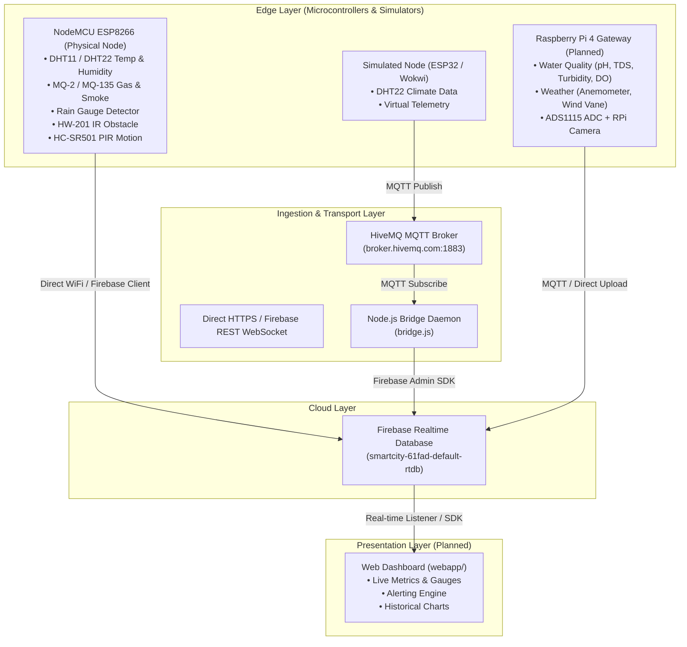

# Smart City IoT Project - Codebase Context & Documentation

This document serves as the master context and technical reference for the **Smart City IoT** project. It details the system architecture, hardware inventory, firmware sketches, backend bridge services, database schemas, current technical gaps, and the execution roadmap for further development.

---

## 1. Project Overview & Objectives

The **Smart City IoT** project is an end-to-end telemetry and monitoring system designed to track urban and environmental conditions in real time. It monitors climate parameters (temperature, humidity, rain), environmental safety (hazardous gas, smoke, air quality), physical security (motion, infrared obstacle detection, magnetic door/window triggers), and environmental quality metrics (water quality, wind telemetry).

### Core Goals:
1. **Multi-Node Sensor Ingestion**: Gather telemetry from microcontrollers (ESP8266, ESP32, Raspberry Pi) and virtual simulation environments (Wokwi).
2. **Dual-Path Transport**: Support direct cloud ingestion via Firebase Realtime Database SDKs and decoupled event-driven ingestion via MQTT brokers (HiveMQ) with a Node.js bridge.
3. **Centralized Data Storage**: Structure real-time state and historical telemetry in Firebase Realtime Database.
4. **Interactive Web Dashboard**: Provide a responsive, real-time UI for city operators, showing live gauges, historical timeline charts, threshold alerts, and node health status.

---

## 2. System Architecture



---

## 3. Directory & File Structure

```
D:\smartcity/
├── API.txt                     # Firebase Web API key and database URL for client apps
├── bridge.js                   # Node.js daemon bridging MQTT topics to Firebase RTDB
├── context.md                  # Project context, architecture, and roadmap (this file)
├── link.docx                   # Reference links for HiveMQ Web Client & Wokwi simulation
├── package.json                # Node.js project manifest & dependencies
├── package-lock.json           # Locked npm dependency versions
├── smartcity-61fad-firebase-adminsdk-fbsvc-eea2762ce1.json # Firebase Admin Service Account Key
├── updated list sensor.pdf     # Hardware sensor procurement and inventory specification
│
├── SENSOR/                     # Microcontroller firmware sketches (Arduino / ESP8266)
│   ├── DHT22_MQ_RAIN/
│   │   └── DHT22_MQ_RAIN.ino   # Multi-sensor sketch with direct Firebase RTDB upload
│   ├── dht22/
│   │   └── dht22.ino           # Basic DHT11/DHT22 reading sketch (Serial output)
│   ├── IR/
│   │   └── IR.ino              # HW-201 IR obstacle detection sketch
│   ├── MQSENSOR/
│   │   └── MQSENSOR.ino        # MQ-2 Analog gas concentration sketch (A0)
│   ├── PIR_Motion/
│   │   └── PIR_Motion.ino      # HC-SR501 PIR motion sensor sketch (GPIO 4 / D2)
│   └── rainguage/
│       └── rainguage.ino       # Power-gated rain sensor sketch (prolongs electrode lifespan)
│
└── webapp/                     # Frontend dashboard application (to be developed)
```

---

## 4. Hardware Inventory & Component Status

From the hardware specification in [`updated list sensor.pdf`](file:///D:/smartcity/updated%20list%20sensor.pdf):

| Category | Component Description | Target Pin / Interface | Role in Smart City | Status |
| :--- | :--- | :--- | :--- | :--- |
| **Compute** | Raspberry Pi 4 Model B (8GB) | Gateway / Host | Central local gateway & edge processing | Planned |
| **Microcontroller** | NodeMCU ESP8266 / ESP32 | Microcontroller | Distributed edge telemetry nodes | In Use / Active |
| **Environment** | DHT11 / DHT22 Sensor | GPIO D3 / GPIO 4 (D2) | Ambient temperature and humidity tracking | Firmware Implemented |
| **Environment** | Rain Sensor Module | GPIO D2 (DO), Power on D7 | Weather monitoring & precipitation alert | Firmware Implemented |
| **Gas / Safety** | MQ-2 / MQ-135 Gas Sensors | Analog A0 / Digital D5 | Smoke, flammable gas, CO2, air quality index | Firmware Implemented |
| **Security** | HW-201 IR Obstacle Sensor | GPIO D2 | Proximity and perimeter obstacle detection | Firmware Implemented |
| **Security** | HC-SR501 PIR Motion Sensor | GPIO 4 (D2) | Area surveillance and intrusion detection | Firmware Implemented |
| **Security** | Reed Switch (x3) | GPIO Digital Input | Smart street cabinets / door / window status | Pending Sketch |
| **Water Quality** | DS18B20 Waterproof Temp Probe | 1-Wire Digital GPIO | Water and drainage temperature tracking | Pending Integration |
| **Water Quality** | Turbidity Sensor Module | Analog (via ADS1115) | Water clarity / suspended particulate monitoring | Pending Integration |
| **Water Quality** | TDS Sensor Module | Analog (via ADS1115) | Total dissolved solids in urban water supply | Pending Integration |
| **Water Quality** | pH Sensor Module + Electrode | Analog (via ADS1115) | Water acidity / alkalinity telemetry | Pending Integration |
| **Water Quality** | Dissolved Oxygen (DO) Sensor | Analog (via ADS1115) | Water oxygenation for environmental waterways | Pending Integration |
| **Weather** | Wind Anemometer + Direction Vane| Analog / RS485 / Pulse | Urban wind velocity and direction measurement | Pending Integration |
| **Expansion** | ADS1115 16-bit 4-Channel ADC | I2C (SDA/SCL) | Expands analog inputs for high-precision sensors| Pending Integration |
| **Expansion** | RS485 to USB Industrial Converter| USB / Serial | Long-distance sensor bus interface | Pending Integration |

---

## 5. Firmware Analysis & Pin Configurations

### 5.1. Combined Node Sketch ([`DHT22_MQ_RAIN.ino`](file:///D:/smartcity/SENSOR/DHT22_MQ_RAIN/DHT22_MQ_RAIN.ino))
* **Target Board**: NodeMCU ESP8266
* **Libraries**: `ESP8266WiFi.h`, `Firebase_ESP_Client.h`, `DHT.h`
* **Pin Mapping**:
  * `D3` (`GPIO 0`): DHT Sensor (Configured as `DHTTYPE DHT11`)
  * `D2` (`GPIO 4`): Rain Sensor digital output (`DO`)
  * `D5` (`GPIO 14`): MQ-2 Gas Sensor digital output (`DO`)
* **Behavior**:
  * Connects to WiFi and authenticates anonymously to Firebase RTDB (`smartcity-61fad`).
  * In `loop()`, reads temperature, humidity, rain state (0 = wet, 1 = dry), and MQ-2 threshold state.
  * Pushes to Firebase every 5,000 ms:
    * `/smartcity/DHT22/temperature`
    * `/smartcity/DHT22/humidity`
    * `/smartcity/Rain/value`
    * `/smartcity/MQ2/value`

### 5.2. Isolated Test Sketches
* **[`dht22.ino`](file:///D:/smartcity/SENSOR/dht22/dht22.ino)**: Reads DHT11 on GPIO 4 (`D2`). Prints Celsius, Fahrenheit, and Humidity every 2 seconds over Serial (9600 baud).
* **[`IR.ino`](file:///D:/smartcity/SENSOR/IR/IR.ino)**: Reads HW-201 digital signal on `D2`. Evaluates `LOW` as object detection.
* **[`MQSENSOR.ino`](file:///D:/smartcity/SENSOR/MQSENSOR/MQSENSOR.ino)**: Reads MQ-2 analog voltage level from pin `A0` (0 - 1023 range), providing gas concentration grading.
* **[`PIR_Motion.ino`](file:///D:/smartcity/SENSOR/PIR_Motion/PIR_Motion.ino)**: Reads HC-SR501 on GPIO 4 (`D2`). Includes a 30-second sensor stabilization pre-warm cycle.
* **[`rainguage.ino`](file:///D:/smartcity/SENSOR/rainguage/rainguage.ino)**: Implements corrosion-prevention power cycling: GPIO `D7` turns sensor VCC ON for 10ms, reads digital state on `D2`, then pulls `D7` LOW.

---

## 6. Backend Services & Integration

### Node.js MQTT-to-Firebase Bridge ([`bridge.js`](file:///D:/smartcity/bridge.js))
* **Runtime**: Node.js (CommonJS)
* **Dependencies**: `mqtt` (v5.x), `firebase-admin` (v14.x)
* **MQTT Broker**: `mqtt://broker.hivemq.com:1883`
* **Firebase Database**: `https://smartcity-61fad-default-rtdb.firebaseio.com/`
* **Credentials**: Uses [`smartcity-61fad-firebase-adminsdk-fbsvc-eea2762ce1.json`](file:///D:/smartcity/smartcity-61fad-firebase-adminsdk-fbsvc-eea2762ce1.json)
* **Current Subscriptions**:
  * `smartcity/dht22/temperature` -> writes `{ value, timestamp }` to `sensor/temperature`
  * `smartcity/dht22/humidity` -> writes `{ value, timestamp }` to `sensor/humidity`

---

## 7. Database Schema Definition & Standardization

To eliminate mismatches between firmware nodes, MQTT bridges, and web dashboards, the following standardized schema is recommended for Firebase Realtime Database:

```json
{
  "smartcity": {
    "live": {
      "node_01": {
        "metadata": {
          "location": "Sector 4 Weather Station",
          "last_seen": 1724490000000,
          "ip_address": "192.168.1.105"
        },
        "environment": {
          "temperature": { "value": 28.5, "unit": "°C", "timestamp": 1724490000000 },
          "humidity": { "value": 65.2, "unit": "%", "timestamp": 1724490000000 },
          "rain_detected": { "value": false, "raw": 1, "timestamp": 1724490000000 }
        },
        "safety": {
          "gas_level_ppm": { "value": 312, "alert": false, "timestamp": 1724490000000 },
          "smoke_detected": { "value": false, "timestamp": 1724490000000 }
        },
        "security": {
          "motion_detected": { "value": false, "timestamp": 1724490000000 },
          "obstacle_detected": { "value": false, "timestamp": 1724490000000 }
        }
      }
    },
    "history": {
      "node_01": {
        "-O4xAbc123": { "temperature": 28.5, "humidity": 65.2, "gas": 312, "timestamp": 1724490000000 }
      }
    },
    "alerts": {
      "-O4xAlert123": {
        "node_id": "node_01",
        "type": "GAS_LEAK",
        "severity": "HIGH",
        "message": "Elevated gas concentration detected on Sector 4 Station",
        "timestamp": 1724490000000,
        "resolved": false
      }
    }
  }
}
```

---

## 8. Critical Gap & Discrepancy Analysis

| Issue | Current State | Impact | Required Resolution |
| :--- | :--- | :--- | :--- |
| **Path Inconsistency** | `bridge.js` writes to `sensor/...`; `DHT22_MQ_RAIN.ino` writes to `/smartcity/...` | Web app cannot read unified data | Align both to the standardized `/smartcity/live/...` schema |
| **MQTT Topic Coverage** | `bridge.js` only listens to 2 topics | Rain, gas, PIR, and simulation telemetry are dropped | Subscribe to wildcard `smartcity/#` or parse structured JSON payloads |
| **Sensor Type Mismatch** | In `.ino`: `#define DHTTYPE DHT11` but publishes under `/DHT22/` | Incorrect calibration / metadata | Correct sensor type definition and variable names |
| **Analog vs Digital Gas** | `DHT22_MQ_RAIN.ino` uses digital `D5` (on/off only); `MQSENSOR.ino` uses analog `A0` (PPM gradient) | Digital only gives binary trigger, losing early warning ppm curve | Switch gas sensing to analog `A0` or use ADS1115 ADC |
| **Missing Web App Directory** | `package.json` specifies `"dev": "node webapp/app.js"`, but `webapp/` does not exist | No dashboard UI available | Create `webapp/` containing an interactive web server or SPA dashboard |
| **Hardcoded Credentials** | WiFi SSID/password and API keys hardcoded in `.ino` and `bridge.js` | Security & portability issues | Introduce `.env` for Node.js and configuration header for Arduino |

---

## 9. Next Steps & Development Roadmap

### Phase 1: Ingestion & Backend Unification
- [ ] **Update `bridge.js`**:
  - Support wildcard subscriptions (`smartcity/#`) or JSON payloads (`smartcity/node_01/telemetry`).
  - Store incoming telemetry using the unified schema with timestamps.
  - Add reconnect and error-handling routines.
- [ ] **Standardize ESP8266 Firmware**:
  - Unify sensor reads (DHT + Analog MQ-2 on A0 + Power-gated Rain sensor on D2/D7 + PIR/IR on available GPIOs).
  - Push structured JSON objects to Firebase RTDB.

### Phase 2: Web Dashboard Development (`webapp/`)
- [ ] Create dashboard application (Node.js/Express server or Vite + React/Vanilla JS).
- [ ] Connect directly to Firebase Realtime Database using the client SDK with keys from [`API.txt`](file:///D:/smartcity/API.txt).
- [ ] Build UI modules:
  - **Live Stat Cards**: Ambient Temp, Relative Humidity, Air Quality PPM, Rain Status.
  - **Security & Hazard Panel**: Motion alerts, IR obstacle triggers, gas threshold warnings.
  - **Historical Telemetry Charts**: Temperature, Humidity, and Gas trends over time.
  - **Map / Node Grid**: Multi-node status and connectivity indicators.

### Phase 3: Hardware Expansion & Multi-Sensor Gateway
- [ ] Write driver scripts / sketches for the ADS1115 16-bit ADC to sample:
  - Turbidity sensor, TDS sensor, pH sensor, Dissolved Oxygen (DO) probe.
  - Wind speed anemometer and wind direction vane.
- [ ] Implement Raspberry Pi 4 gateway service to aggregate advanced telemetry and push to Firebase/MQTT.
