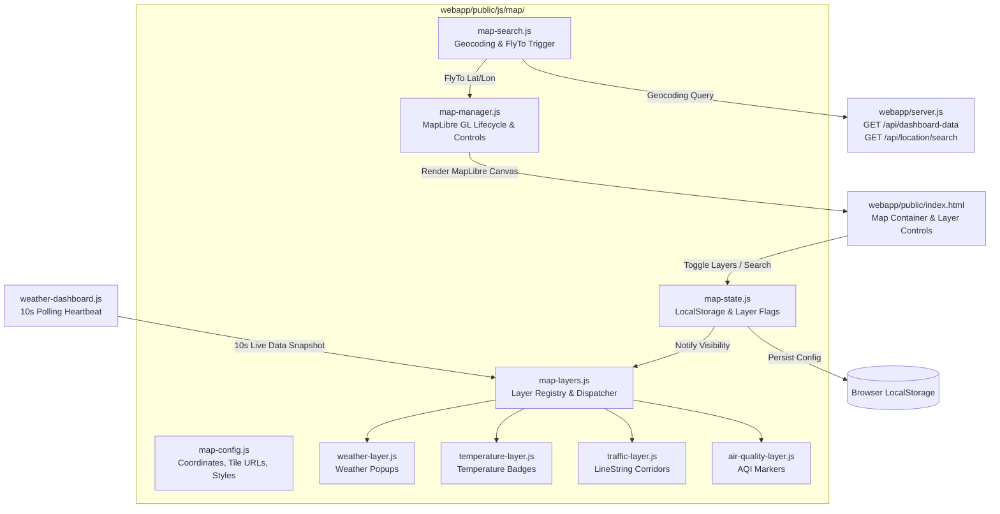

# Smart City Live Map Integration — Phase-wise Engineering & Manual Test Plan

**Document Version**: 1.0.0  
**Target Platform**: Smart City Web Portal (`webapp/`) — Anand, Gujarat, India  
**Reference Document**: [`Smart City Map Integration — Phase-wise Coding Plan.md`](file:///D:/smartcity/Smart%20City%20Map%20Integration%20%E2%80%94%20Phase-wise%20Coding%20Plan.md)  
**System Architecture Context**: [`context.md`](file:///D:/smartcity/context.md)  
**Status**: Ready for Phased Execution (Planning Stage Only — Zero Code Implemented)

---

## 1. Executive Summary & Architectural Vision

The objective of this project is to seamlessly embed a high-performance, modular, interactive **Urban Live Map** into the existing **Smart City Weather & Environmental Dashboard** ([`webapp/public/index.html`](file:///D:/smartcity/webapp/public/index.html)). 

The live map serves as a spatial command canvas visualizing the four foundational urban telemetry domains of Anand, Gujarat:
1. **Weather & Sky Conditions**: Live cloud conditions, rainfall probability, and wind headings.
2. **Temperature & Thermal Comfort**: Real-time ambient temperature annotations and thermal comfort ratings.
3. **Urban Mobility & Traffic Flow**: Live corridor velocity, delay, and congestion segment lines.
4. **Air Quality Index & Particulates**: City-level and station AQI scores with inhalable particulate telemetry ($\text{PM}_{2.5}, \text{PM}_{10}$).

```
┌────────────────────────────────────────────────────────────────────────────────────────┐
│ SMART CITY URBAN OPERATIONS PORTAL — ANAND, GUJARAT, INDIA                             │
├────────────────────────────────────────────────────────────────────────────────────────┤
│ [Upper Row: Box 1 Weather | Box 2 Air Quality | Box 3 Traffic Mobility]                │
├────────────────────────────────────────────────────────────────────────────────────────┤
│ ▼ URBAN LIVE MAP ENGINE                                           [ ✕ Hide Map ] [ ⛶ ] │
│ ┌─────────────────────────────────────────────────────────────┐                        │
│ │ 🔍 Search location (e.g., Vidyanagar, Station Rd, Vadodara) │                        │
│ └─────────────────────────────────────────────────────────────┘                        │
│ ┌────────────────────────────────────────────────────────────────────────────────────┐ │
│ │                                                                                    │ │
│ │                 [ 🌦 28.2°C Overcast ]                                             │ │
│ │                                                                                    │ │
│ │             ══════[ SH 188: 29 km/h (Smooth) ]══════                               │ │
│ │                                                                                    │ │
│ │                                   [ 🛡 AQI 72 Moderate ]                           │ │
│ │                                                                                    │ │
│ └────────────────────────────────────────────────────────────────────────────────────┘ │
│ Layers: [✔] Weather   [✔] Temperature   [✔] Traffic Corridors   [✔] Air Quality        │
├────────────────────────────────────────────────────────────────────────────────────────┤
│ [Bottom Row: Box 4 Microclimate Telemetry Analysis & NAAQS Safety Scorecards]         │
└────────────────────────────────────────────────────────────────────────────────────────┘
```

### Strict Non-Functional Constraints
- **Zero Firebase Dependency**: The map engine, its layers, search mechanisms, and telemetry ingestors must have **zero dependency on Firebase**. All map telemetry will consume standard REST backend APIs.
- **Provider Independence & Modularity**: The rendering engine ([MapLibre GL JS](https://maplibre.org/)) must be strictly decoupled from base map tile providers, geocoding engines, and telemetry sources. Tile and geocoding providers can be swapped via configuration without touching layer or UI code.
- **Visual Harmony with Dark Glassmorphism Theme**: The map must match the dashboard's Tailwind dark aesthetic (`#030712` background, Carto Dark basemap tiles, slate borders, and neon telemetry accents: sky-400 for weather, emerald-400 for healthy AQI, rose-500 for traffic congestion).
- **Single Polling Loop & Rate Limit Protection**: The map data controller must synchronize directly with the dashboard's 10-second polling heartbeat (`weather-dashboard.js`). No redundant background timer intervals.
- **Client-Side Storage**: Map visibility toggle, active layers, and the last searched coordinates must persist across reloads via `localStorage`.

---

## 2. Current Implementation Analysis & Gap Assessment

An in-depth analysis of the current `D:\smartcity` codebase reveals the following integration realities:

| Component | Current State | Map Integration Readiness & Gap Analysis |
| :--- | :--- | :--- |
| **Backend Web Server** (`webapp/server.js`) | Express server on port `3000`. Exposes `/api/dashboard-data` and `/api/health`. Serves static files from `webapp/public`. | **Ready, with minor endpoint additions**: Needs a lightweight geocoding proxy (`/api/location/search?q=...`) to avoid browser CORS/rate-limiting issues with Nominatim, and coordinate-specific weather lookup (`/api/location/weather?lat=...&lon=...`). |
| **Telemetry Aggregator** (`webapp/smartcity-service.js`) | Aggregates Anand live weather (Open-Meteo), air quality (Open-Meteo AQI), and TomTom traffic flow segment. 45s server cache. | **Ready, requires corridor GeoJSON data**: Traffic corridors (`SH 188`, `Station Road`, `NH 48`, `Borsad Chokdi`) currently only have numeric speeds; need geographic LineString coordinates mapped for spatial rendering. |
| **Main Dashboard HTML** (`webapp/public/index.html`) | Single page layout containing Header, 3 domain cards (Weather, Air Quality, Traffic), and Deep Analysis section. | **Requires dedicated Map Section**: Need to insert a responsive, collapsible `<section id="urbanMapSection">` between the upper three boxes and the microclimate analysis section. |
| **Dashboard Controller** (`webapp/public/js/weather-dashboard.js`) | Class `WeatherAirDashboard` polls `/api/dashboard-data` every 10 seconds, maintains unit switcher (°C/°F), and updates DOM/charts. | **Integration Anchor**: The `MapDataController` will hook into `renderDashboard(data)` to receive fresh telemetry snapshots every 10 seconds without spawning extra network requests. |
| **IoT Command Center** (`webapp/public/iot-dashboard.html`) | Standalone hardware diagnostic dashboard listening directly to Firebase Realtime Database. | **Completely Isolated**: Kept completely independent and untouched. |

---

## 3. Target Map Architecture & File Blueprint

All map logic will reside in a dedicated, clean directory structure under `webapp/public/js/map/`:

```
webapp/public/
├── index.html                                 # Dashboard page with #urbanMapSection added
├── css/
│   └── style.css                              # Custom MapLibre dark popup and marker styles
└── js/
    ├── weather-dashboard.js                   # Main dashboard controller (syncs map with 10s poll)
    └── map/
        ├── map-config.js                      # Default center (Anand), zoom, styles, layer keys
        ├── map-state.js                       # LocalStorage persistence & reactive state holder
        ├── map-manager.js                     # Core MapLibre GL wrapper (init, flyTo, resize, visibility)
        ├── map-layers.js                      # Layer orchestration (Weather, Temp, Traffic, AQI)
        ├── map-search.js                      # Geocoding autocomplete & search handling
        ├── weather-layer.js                   # Weather marker & rich popup renderer
        ├── temperature-layer.js               # Thermal zone & temperature pill badge renderer
        ├── traffic-layer.js                   # GeoJSON LineString corridor & congestion renderer
        └── air-quality-layer.js               # AQI score badge & particulate distribution popup
```

### Module Responsibilities & Class Contracts



---

## 4. Phased Implementation Roadmap

To ensure continuous application stability, zero regressions, and measurable milestone delivery, the map integration is divided into **11 sequential phases (Phase 0 to Phase 10)**. 

Each phase contains:
- **Core Objectives & Scope**
- **Files Created / Modified**
- **Implementation Specifications**
- **Definition of Done**

---

### Phase 0: Pre-requisites, Backend Extensions & Data Geometry Alignment

#### Objectives
1. Add geospatial coordinates and GeoJSON LineStrings for Anand's core traffic corridors to [`webapp/smartcity-service.js`](file:///D:/smartcity/webapp/smartcity-service.js).
2. Create lightweight server-side geocoding endpoint `GET /api/location/search?q=...` in [`webapp/server.js`](file:///D:/smartcity/webapp/server.js) proxying Nominatim with rate-limit protection and caching.
3. Verify `/api/dashboard-data` returns valid geospatial features alongside existing numeric telemetry.

#### Files Modified
- [`webapp/smartcity-service.js`](file:///D:/smartcity/webapp/smartcity-service.js)
- [`webapp/server.js`](file:///D:/smartcity/webapp/server.js)

#### Specifications
- Anand Center: `[72.9289, 22.5645]` (Longitude, Latitude for GeoJSON standard).
- Corridor Geometries:
  - **SH 188 (Anand – Vidyanagar Road)**: LineString connecting Anand Railway Junction to Sardar Patel University.
  - **Station Road (Anand Junction)**: LineString connecting Borsad Chokdi to Station Roundabout.
  - **NH 48 Samarkha Expressway**: LineString along Samarkha junction corridor.
  - **Borsad Chokdi Junction**: Point / junction intersection.

---

### Phase 1: Map Engine & Base Canvas Integration

#### Objectives
1. Include MapLibre GL JS (`v3.6.2` or modern stable) and stylesheet into [`webapp/public/index.html`](file:///D:/smartcity/webapp/public/index.html).
2. Create `webapp/public/js/map/map-config.js` defining Carto Dark tile source, Anand center coordinates, and default zoom levels ($13.0$).
3. Create `webapp/public/js/map/map-manager.js` to instantiate and manage the MapLibre GL instance.
4. Add the responsive `<section id="urbanMapSection">` to [`index.html`](file:///D:/smartcity/webapp/public/index.html) with dark glassmorphism borders and loading skeleton.

#### Files Created / Modified
- [`webapp/public/index.html`](file:///D:/smartcity/webapp/public/index.html)
- `webapp/public/js/map/map-config.js`
- `webapp/public/js/map/map-manager.js`
- [`webapp/public/css/style.css`](file:///D:/smartcity/webapp/public/css/style.css)

#### Specifications
- Base style uses Carto Dark raster tiles: `https://basemaps.cartocdn.com/dark_all/{z}/{x}/{y}@2x.png`.
- Attributions properly credited: OpenStreetMap & CARTO.
- Container height: `440px` on desktop, `320px` on mobile, rounded-2xl glassmorphism.

---

### Phase 2: Map Controls, Collapsible Visibility & State Persistence

#### Objectives
1. Implement navigation controls (Zoom In, Zoom Out, Compass / Reset Bearing).
2. Implement Fullscreen toggle button.
3. Implement **[ Hide Map / Show Map ]** toggle button in the map header.
4. Create `webapp/public/js/map/map-state.js` to save and restore user preferences (`isMapVisible`, active layers) in `localStorage`.
5. Implement automatic map resize handling (`map.resize()`) when expanding from collapsed state.

#### Files Created / Modified
- `webapp/public/js/map/map-state.js`
- `webapp/public/js/map/map-manager.js`
- [`webapp/public/index.html`](file:///D:/smartcity/webapp/public/index.html)

---

### Phase 3: Location Search Engine & Geocoding Integration

#### Objectives
1. Build search input UI with search icon, clear button, and autocomplete suggestions dropdown.
2. Create `webapp/public/js/map/map-search.js` that calls `/api/location/search?q=...` with debouncing ($350\text{ ms}$).
3. When user selects a search result, trigger smooth camera transition:
   ```javascript
   map.flyTo({ center: [lon, lat], zoom: 14, essential: true });
   ```
4. Drop an animated pulsing marker pin at the searched coordinates.
5. Provide a "Reset to Anand" button to return the camera back to Anand city center.

#### Files Created / Modified
- `webapp/public/js/map/map-search.js`
- `webapp/public/js/map/map-manager.js`
- [`webapp/public/index.html`](file:///D:/smartcity/webapp/public/index.html)

---

### Phase 4: Weather Condition Telemetry Layer

#### Objectives
1. Create `webapp/public/js/map/weather-layer.js`.
2. Add a customized, non-intrusive weather badge marker at the Anand station coordinates.
3. Marker displays: Weather condition icon, condition text (*Overcast*), and rain probability tag (*72% Rain*).
4. Clicking the marker opens a dark glassmorphism popup displaying:
   - Location: Anand, Gujarat
   - Sky condition & weather icon
   - Wind speed and direction ($11\text{ km/h W}$)
   - Barometric pressure ($1004\text{ hPa}$)
   - Rain probability ($72\%$) & precipitation volume ($0.0\text{ mm}$)

#### Files Created / Modified
- `webapp/public/js/map/weather-layer.js`
- `webapp/public/js/map/map-layers.js`
- [`webapp/public/css/style.css`](file:///D:/smartcity/webapp/public/css/style.css)

---

### Phase 5: Temperature Telemetry Annotation Layer

#### Objectives
1. Create `webapp/public/js/map/temperature-layer.js`.
2. Render a high-visibility temperature pill badge on the map:
   - Displays current temperature (`28.2 °C` or `82.8 °F`).
   - Thermal comfort status color indicator (Optimal Comfort: emerald-400 / Warm: amber-400 / Hot: rose-400).
3. Connect the temperature badge directly to the existing inline `[ Switch to °F ]` button in Box 1 so that toggling units instantly converts the map's temperature badge.
4. Clicking opens a thermal breakdown popup displaying Heat Index ($31.3^\circ\text{C}$), Dew Point ($21.8^\circ\text{C}$), and Diurnal Range ($24^\circ\text{C}\text{–}33^\circ\text{C}$).

#### Files Created / Modified
- `webapp/public/js/map/temperature-layer.js`
- `webapp/public/js/map/map-layers.js`

---

### Phase 6: Urban Traffic & Mobility Layer

#### Objectives
1. Create `webapp/public/js/map/traffic-layer.js`.
2. Add GeoJSON source and MapLibre `line` layers rendering Anand's 4 transit corridors:
   - `SH 188 (Anand – Vidyanagar Road)`
   - `Station Road (Anand Junction)`
   - `NH 48 Samarkha Expressway`
   - `Borsad Chokdi Junction`
3. Color-code road lines dynamically based on live congestion index:
   - **Low Congestion ($\le 25\%$)**: Emerald green (`#10b981`)
   - **Moderate Congestion ($26\% - 45\%$)**: Amber orange (`#f59e0b`)
   - **Heavy Congestion ($> 45\%$)**: Rose red (`#ef4444`)
4. Clicking any road segment displays a corridor popup showing current velocity, free-flow speed, congestion percentage, and travel delay.

#### Files Created / Modified
- `webapp/public/js/map/traffic-layer.js`
- `webapp/public/js/map/map-layers.js`

---

### Phase 7: Air Quality & Particulate Matter Layer

#### Objectives
1. Create `webapp/public/js/map/air-quality-layer.js`.
2. Render a glowing circular AQI badge marker at the Anand central air monitoring station.
3. Badge shows current AQI value (`72`) and safety label (`Moderate`).
4. Color scheme matches EPA AQI standards (Green for Good, Yellow/Amber for Moderate, Red for Unhealthy).
5. Clicking the marker opens a rich popup with particulate concentrations ($\text{PM}_{2.5}$, $\text{PM}_{10}$) and trace gases ($\text{NO}_2$, $\text{O}_3$, $\text{CO}$, $\text{SO}_2$) compared against NAAQS guidelines.

#### Files Created / Modified
- `webapp/public/js/map/air-quality-layer.js`
- `webapp/public/js/map/map-layers.js`

---

### Phase 8: Centralized Orchestration & Polling Synchronization

#### Objectives
1. Integrate the map subsystem into [`webapp/public/js/weather-dashboard.js`](file:///D:/smartcity/webapp/public/js/weather-dashboard.js).
2. Wire `mapLayers.updateAll(data)` into `WeatherAirDashboard.renderDashboard(data)` so that every 10-second poll refreshes:
   - Weather marker
   - Temperature badge
   - Traffic corridor line colors and speeds
   - AQI marker
3. Ensure zero duplicate API calls and zero separate polling intervals.
4. Implement individual layer toggle checkboxes in the map toolbar (`[✔] Weather`, `[✔] Temperature`, `[✔] Traffic`, `[✔] Air Quality`).

#### Files Created / Modified
- [`webapp/public/js/weather-dashboard.js`](file:///D:/smartcity/webapp/public/js/weather-dashboard.js)
- `webapp/public/js/map/map-layers.js`
- [`webapp/public/index.html`](file:///D:/smartcity/webapp/public/index.html)

---

### Phase 9: Multi-Location Telemetry Discovery & Fallback Handling

#### Objectives
1. When a user searches for another city (e.g., Vadodara, Ahmedabad, Mumbai):
   - Move camera to coordinates and display a marked pin.
   - Query backend coordinate-weather endpoint: `GET /api/location/weather?lat=...&lon=...`.
   - Update map weather/temp popup for the searched location.
2. Display graceful fallback messages for data not available in non-Anand locations:
   - `Traffic data unavailable for this location (Anand corridors only)`
   - `Local station air quality unavailable`
3. Ensure Anand telemetry is **never** mistakenly attributed to another searched city.

#### Files Created / Modified
- [`webapp/server.js`](file:///D:/smartcity/webapp/server.js)
- [`webapp/smartcity-service.js`](file:///D:/smartcity/webapp/smartcity-service.js)
- `webapp/public/js/map/map-search.js`

---

### Phase 10: Hardening, Performance Optimization & Documentation

#### Objectives
1. Error resilience: Ensure map continues functioning smoothly if Open-Meteo, TomTom, or Nominatim APIs encounter downtime.
2. Responsive optimization across Desktop ($1920\times1080$), Tablet ($768\times1024$), and Mobile ($375\times812$).
3. Memory leak audit: Clean up MapLibre popups, event listeners, and GeoJSON sources.
4. Update [`context.md`](file:///D:/smartcity/context.md) to record the live interactive map architecture.

#### Files Modified
- [`webapp/public/js/map/map-manager.js`](file:///D:/smartcity/webapp/public/js/map/map-manager.js)
- [`context.md`](file:///D:/smartcity/context.md)

---

## 5. Comprehensive Manual Test Plan for Every Phase

To ensure rock-solid verification before proceeding between phases, the following exhaustive manual test plan must be executed at every milestone.

---

### Test Plan: Phase 0 — Prerequisites & Data Contract Verification

| Test ID | Test Scenario | Steps to Execute | Expected Result | Pass / Fail Criteria |
| :--- | :--- | :--- | :--- | :--- |
| **TC-0.1** | Verify Server Startup | Run `node webapp/server.js` in terminal. | Server starts on port 3000 with clean console logs and location Anand. | Port 3000 bound without fatal crash. |
| **TC-0.2** | Verify Traffic Corridors Data Model | In PowerShell: `Invoke-RestMethod http://localhost:3000/api/dashboard-data \| Select-Object -ExpandProperty traffic` | Output contains `corridors` array with coordinates or LineString geometries alongside speed & status. | All 4 Anand corridors have valid numeric speed and coordinate definitions. |
| **TC-0.3** | Verify Geocoding Proxy Endpoint | In browser or curl: `GET http://localhost:3000/api/location/search?q=Anand` | Returns JSON array of matched places with `display_name`, `lat`, `lon`. | Returns HTTP 200 with at least 1 match containing lat around 22.56, lon around 72.92. |
| **TC-0.4** | Verify Search Proxy Rate Limiting | Send 5 rapid search queries within 1 second. | Backend handles requests gracefully, returning cached results or throttled response without throwing 500. | Zero unhandled exceptions in backend log. |

---

### Test Plan: Phase 1 — Map Canvas & Base Tile Rendering

| Test ID | Test Scenario | Steps to Execute | Expected Result | Pass / Fail Criteria |
| :--- | :--- | :--- | :--- | :--- |
| **TC-1.1** | Verify Map Container Loading | Navigate to `http://localhost:3000/` in browser. | Section `#urbanMapSection` is visible between upper 3 boxes and microclimate analysis. | Glassmorphism card rendered with header "Urban Live Map". |
| **TC-1.2** | Verify Carto Dark Basemap Tiles | Inspect network tab in browser DevTools; filter by `png`. | Raster tile requests to `basemaps.cartocdn.com` return HTTP 200. | Map canvas shows dark gray street map of Anand, Gujarat. |
| **TC-1.3** | Verify Initial Coordinates & Zoom | Check map center in console: `map.getCenter()` and `map.getZoom()`. | Center is Longitude $\approx 72.9289$, Latitude $\approx 22.5645$, Zoom $\approx 13.0$. | Anand city center clearly framed in map viewport. |
| **TC-1.4** | Verify Tile Attribution | Inspect bottom right corner of map canvas. | OpenStreetMap and CARTO attributions are present, styled cleanly without breaking layout. | Legal attributions visible. |

---

### Test Plan: Phase 2 — Map Controls, Collapsible Visibility & Persistence

| Test ID | Test Scenario | Steps to Execute | Expected Result | Pass / Fail Criteria |
| :--- | :--- | :--- | :--- | :--- |
| **TC-2.1** | Zoom In & Zoom Out Controls | Click the `+` and `-` navigation buttons on the map. | Map zooms in smoothly on `+` and zooms out smoothly on `-`. | Zoom changes by 1 level per click. |
| **TC-2.2** | Fullscreen Toggle | Click the Fullscreen icon button. | Map container expands to occupy the full monitor display. Pressing `Esc` restores original size. | Fullscreen API triggers without canvas distortion. |
| **TC-2.3** | Hide Map Toggle | Click the `[ Hide Map ]` button in the map header. | Map container slides or collapses smoothly. Button text changes to `[ Show Map ]`. Upper boxes and microclimate analysis move together cleanly. | Map canvas is hidden; no DOM layout shifts or horizontal scrollbars. |
| **TC-2.4** | Show Map & Canvas Resize Reflow | Click `[ Show Map ]` to un-collapse the map. | Map canvas becomes visible and instantly calls `map.resize()`. | Tiles re-render crisp and sharp; no blank grey canvas or clipped margins. |
| **TC-2.5** | LocalStorage Persistence | Hide the map, then reload the page (`F5` or `Ctrl+R`). | Page reloads with the map already in collapsed/hidden state. | `localStorage.getItem('smartcity_map_visible') === 'false'`. |

---

### Test Plan: Phase 3 — Geocoding & Location Search

| Test ID | Test Scenario | Steps to Execute | Expected Result | Pass / Fail Criteria |
| :--- | :--- | :--- | :--- | :--- |
| **TC-3.1** | Search Input Rendering | Inspect search bar in map toolbar. | Clean search input with placeholder `Search location (e.g., Vidyanagar, Vadodara)...` and search button. | Visual styling matches dark glassmorphism theme. |
| **TC-3.2** | Autocomplete Suggestions Dropdown | Type `Vidyanagar` into search box. | After 350ms debounce, a dropdown appears showing matching locations (Vallabh Vidyanagar, Anand). | Network tab shows 1 call to `/api/location/search?q=Vidyanagar`. |
| **TC-3.3** | Select Result & Smooth FlyTo | Click on `Vallabh Vidyanagar, Anand, Gujarat` from the dropdown list. | Map camera smoothly flies (`map.flyTo`) to Vallabh Vidyanagar coordinates. An animated pin marker appears. | Map center updates to Vidyanagar ($22.553^\circ\text{ N}, 72.924^\circ\text{ E}$). |
| **TC-3.4** | Reset to Anand Button | Click the `Reset to Anand` button. | Map smoothly flies back to Anand city center ($22.5645, 72.9289$) at zoom $13$. | Camera returns home cleanly. |
| **TC-3.5** | Search Non-Existent Place | Type `xyznonexistentlocation12345` and press Enter. | Displays a subtle inline alert: `Location not found. Please try another query.` | Map does not crash or navigate to `NaN, NaN`. |

---

### Test Plan: Phase 4 — Weather Condition Telemetry Layer

| Test ID | Test Scenario | Steps to Execute | Expected Result | Pass / Fail Criteria |
| :--- | :--- | :--- | :--- | :--- |
| **TC-4.1** | Weather Marker Display | Ensure `[✔] Weather` checkbox is enabled. | A custom weather marker is visible at Anand coordinates showing sky icon and condition text (*Overcast*). | Marker coordinates match Anand weather station. |
| **TC-4.2** | Weather Popup Details | Click on the weather marker. | A dark glassmorphism popup opens showing: Condition, Wind speed/heading ($11\text{ km/h W}$), Barometer ($1004\text{ hPa}$), Rain probability ($72\%$). | Values strictly match Box 1 Weather Conditions card. |
| **TC-4.3** | Weather Layer Toggle | Uncheck `[ ] Weather` checkbox in map toolbar. | The weather marker and its popup instantly disappear from the map. Re-checking restores them. | Layer visibility toggles instantaneously without map reload. |

---

### Test Plan: Phase 5 — Temperature Telemetry Annotation Layer

| Test ID | Test Scenario | Steps to Execute | Expected Result | Pass / Fail Criteria |
| :--- | :--- | :--- | :--- | :--- |
| **TC-5.1** | Temperature Pill Marker Display | Ensure `[✔] Temperature` checkbox is enabled. | A glowing pill badge is visible on the map displaying `28.2 °C`. | Thermal color indicator matches zone (Optimal: emerald). |
| **TC-5.2** | Synchronous Unit Conversion (°C / °F) | Click the `[ Switch to °F ]` button in Box 1 of the dashboard. | Box 1 temperature switches to `82.8 °F`, Box 4 analysis switches to `°F`, and the map's temperature badge switches to `82.8 °F` simultaneously! | All temperature displays remain 100% in sync across the dashboard and map. |
| **TC-5.3** | Temperature Popup Details | Click the temperature badge on the map. | Popup opens displaying: Apparent Heat Index, Dew Point Temperature, and Expected Diurnal Range. | Popup metrics reflect selected temperature unit (°C or °F). |
| **TC-5.4** | Temperature Layer Toggle | Uncheck `[ ] Temperature` in toolbar. | Temperature badge disappears. Checking it restores the badge with current unit. | Toggles cleanly. |

---

### Test Plan: Phase 6 — Urban Traffic & Mobility Layer

| Test ID | Test Scenario | Steps to Execute | Expected Result | Pass / Fail Criteria |
| :--- | :--- | :--- | :--- | :--- |
| **TC-6.1** | Corridor Line Geometry Rendering | Ensure `[✔] Traffic Corridors` checkbox is enabled. Zoom into Anand. | 4 colored route lines are rendered over Anand's arterial roads (SH 188, Station Road, NH 48, Borsad Chokdi). | Lines follow actual road alignments without drawing arbitrary straight lines across buildings. |
| **TC-6.2** | Congestion Color Coding | Observe the colors of the corridor lines. | Segments with $\le 25\%$ congestion are emerald green; segments with $26-45\%$ congestion are amber/orange; $>45\%$ are red. | Colors accurately reflect congestion percentage. |
| **TC-6.3** | Corridor Popup Inspection | Click on the `SH 188 (Anand – Vidyanagar Road)` line. | Popup opens displaying: Corridor name, Current speed ($29\text{ km/h}$), Free-flow speed ($50\text{ km/h}$), Congestion index ($40\%$), Delay ($+55\text{ sec}$). | Data matches Box 3 Traffic list exactly. |
| **TC-6.4** | Traffic Layer Toggle | Uncheck `[ ] Traffic Corridors`. | All road segment lines vanish from the map. Checking the box restores them. | MapLibre `setLayoutProperty(layerId, 'visibility', ...)` executes cleanly. |

---

### Test Plan: Phase 7 — Air Quality & Particulate Matter Layer

| Test ID | Test Scenario | Steps to Execute | Expected Result | Pass / Fail Criteria |
| :--- | :--- | :--- | :--- | :--- |
| **TC-7.1** | AQI Marker Display | Ensure `[✔] Air Quality` checkbox is enabled. | A circular glowing badge is rendered displaying `72 AQI` with status `Moderate`. | Visual glow color matches AQI band (Yellow/Amber for Moderate). |
| **TC-7.2** | AQI Details Popup | Click on the AQI badge marker. | Popup opens displaying: AQI index, Particulate matter ($\text{PM}_{2.5}: 16.5\ \mu\text{g/m}^3, \text{PM}_{10}: 27.5\ \mu\text{g/m}^3$), and trace gases ($\text{NO}_2, \text{O}_3, \text{CO}, \text{SO}_2$). | Values strictly match Box 2 Air Quality Index card. |
| **TC-7.3** | AQI Layer Toggle | Uncheck `[ ] Air Quality`. | AQI badge and popup disappear. Checking the box restores the marker. | Toggles cleanly. |

---

### Test Plan: Phase 8 — Centralized Polling & State Persistence

| Test ID | Test Scenario | Steps to Execute | Expected Result | Pass / Fail Criteria |
| :--- | :--- | :--- | :--- | :--- |
| **TC-8.1** | Synchronized 10-Second Auto-Poll | Open browser Network DevTools. Keep the dashboard open for 30 seconds. | Every 10 seconds, exactly ONE request is made to `/api/dashboard-data`. Map markers update in-place without flicker. | Zero duplicate requests or independent timers initiated by map layers. |
| **TC-8.2** | Layer Preference Persistence | Toggle: Weather [✔], Temperature [ ], Traffic [✔], Air Quality [ ]. Reload page (`F5`). | Page reloads with Weather ON, Temperature OFF, Traffic ON, Air Quality OFF. | State restored from `localStorage['smartcity_map_layers']`. |
| **TC-8.3** | Manual Refresh Button Sync | Click the manual refresh button (`#manualRefreshBtn`) in the top navigation header. | Dashboard icon spins, fresh data arrives, and all map layers update synchronously. | Map updates in tandem with header clock and domain cards. |

---

### Test Plan: Phase 9 — Multi-Location Search & Telemetry Fallback

| Test ID | Test Scenario | Steps to Execute | Expected Result | Pass / Fail Criteria |
| :--- | :--- | :--- | :--- | :--- |
| **TC-9.1** | Search Another Major City | Search for `Vadodara, Gujarat` and select it. | Map flies to Vadodara coordinates ($22.3072^\circ\text{ N}, 73.1812^\circ\text{ E}$). Pin dropped. | Camera transitions smoothly. |
| **TC-9.2** | Searched Location Weather Popup | Click the pin at Vadodara. | Displays live temperature and condition for Vadodara retrieved via `/api/location/weather?lat=...&lon=...`. | Accurate Vadodara weather shown. |
| **TC-9.3** | Strict Anand Telemetry Isolation | Check traffic and AQI on the Vadodara pin. | Popup clearly indicates: `Traffic corridor data available for Anand network only` and `Local station AQI unavailable`. | Anand speeds and AQI values are NEVER misattributed to Vadodara. |
| **TC-9.4** | Return to Anand via Home Button | Click `Reset to Anand`. | Camera flies back to Anand ($22.5645, 72.9289$), and Anand layers (corridors, stations) are fully active. | State resets cleanly. |

---

### Test Plan: Phase 10 — Error Resilience, Responsiveness & Performance

| Test ID | Test Scenario | Steps to Execute | Expected Result | Pass / Fail Criteria |
| :--- | :--- | :--- | :--- | :--- |
| **TC-10.1** | Upstream API Failure Simulation | Temporarily disconnect internet or block `open-meteo.com` in DevTools. | Map canvas remains interactive. Badges show cached values or friendly `Telemetry updating...` badge. Dashboard does not crash. | Zero uncaught TypeError exceptions. |
| **TC-10.2** | Responsive Layout (Desktop 1920x1080) | View on full desktop monitor. | Map occupies full container width ($1280\text{px}$ max), toolbar buttons aligned horizontally, popups positioned cleanly. | No visual overflows. |
| **TC-10.3** | Responsive Layout (Tablet 768x1024) | Switch DevTools to iPad view. | Map container resizes smoothly, search bar and layer controls wrap gracefully. | Touch pan and pinch-to-zoom function naturally. |
| **TC-10.4** | Responsive Layout (Mobile 375x812) | Switch DevTools to iPhone view. | Map height scales to $320\text{px}$, layer controls render as touch-friendly horizontal chips, popups fit viewport. | Fully usable on small mobile screens. |
| **TC-10.5** | Memory Leak Audit | Pan, zoom, toggle layers on/off 20 times, open/close popups. Check DevTools Memory tab. | Memory footprint remains stable ($\le 45\text{ MB}$ JS heap); zero detached DOM element accumulation. | Garbage collection cleans detached elements. |

---

## 6. Security, Provider Independence & Configuration Governance

### Provider Swapping Matrix
To ensure long-term sustainability without vendor lock-in, the mapping subsystem maintains clean configuration boundaries:

| Service | Default Implementation | Alternative Provider Option | Required File Change |
| :--- | :--- | :--- | :--- |
| **Base Map Rendering** | MapLibre GL JS | OpenLayers / Leaflet | `map-manager.js` only |
| **Map Tile Provider** | Carto Dark (`basemaps.cartocdn.com`) | OpenStreetMap / MapTiler / Stadia | `map-config.js` (`MAP_TILE_URL`) |
| **Geocoding Engine** | Backend-proxied Nominatim | Photon / Pelias / TomTom Geocoding | `server.js` (`/api/location/search`) |
| **Traffic Telemetry** | TomTom Traffic Flow API | HERE Traffic / Mapbox Traffic | `smartcity-service.js` |
| **Weather Telemetry** | Open-Meteo & Weatherstack | OpenWeatherMap / Tomorrow.io | `smartcity-service.js` |

### Security Boundaries
- **No Client-Side Secrets**: Private API keys (TomTom, Weatherstack) are stored only in server-side text files / environment variables; never exposed to browser bundles or map layers.
- **Strict Content Security**: Geocoding calls are proxied through Express (`/api/location/search`) with a strict User-Agent header complying with OpenStreetMap usage policies.
- **Isolation of IoT Command Center**: Physical IoT hardware sensor command center (`iot-dashboard.html`) remains completely isolated with its own dedicated Firebase Realtime Database listeners.

---

## 7. Next Steps & Execution Instructions

This plan is prepared and saved in `D:\smartcity\plan\SMART_CITY_MAP_INTEGRATION_PLAN.md`.

When authorized by the user to begin implementation, execution will proceed strictly in accordance with **Phase 0 through Phase 10**:
1. Execute one phase at a time.
2. Run the dedicated **Manual Test Plan** for that specific phase.
3. Validate and verify all test criteria before proceeding to the next milestone.
4. Keep the codebase stable and runnable at every commit point.
